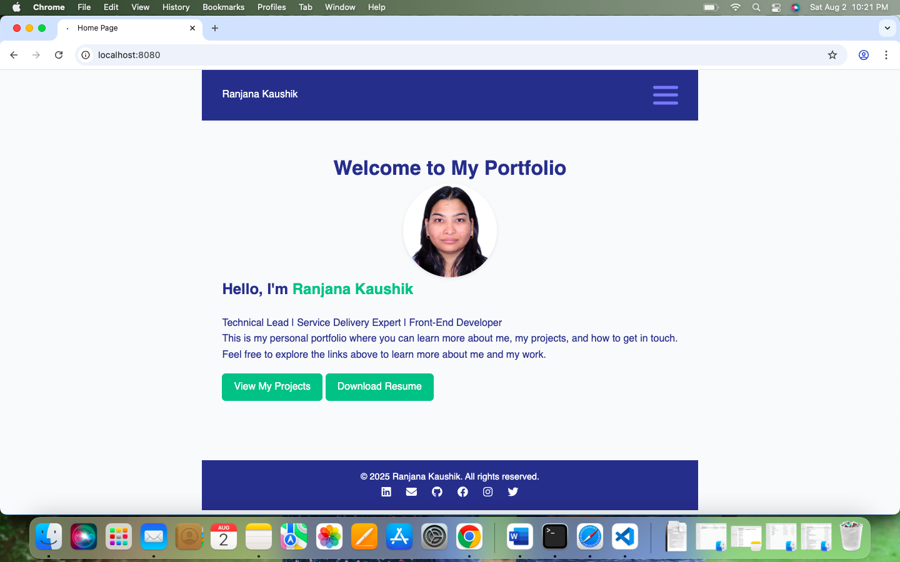
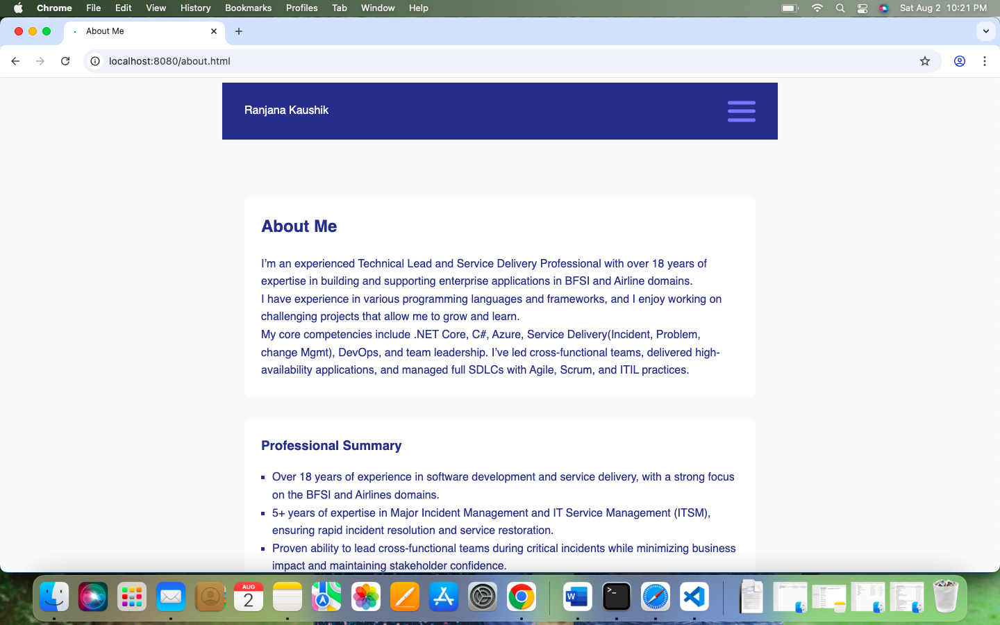
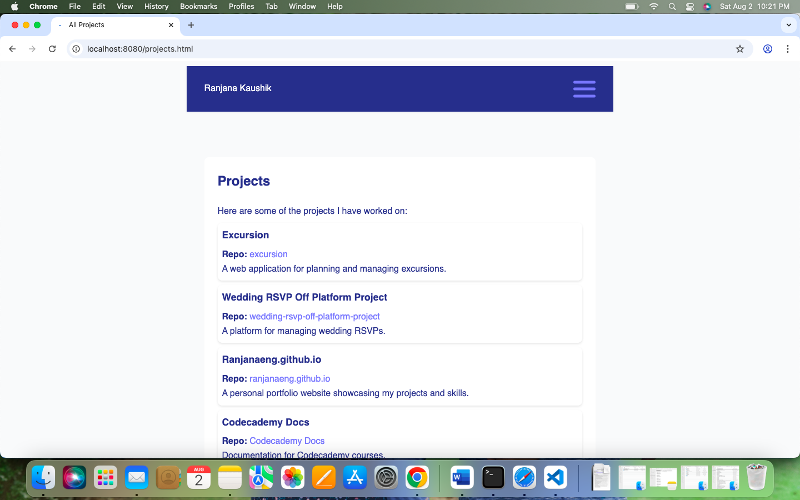
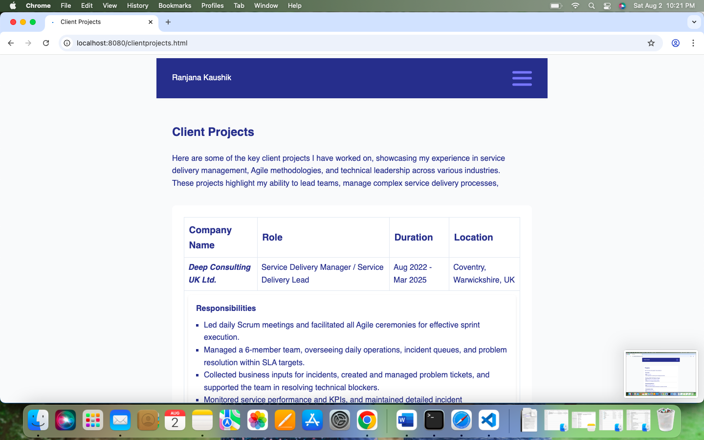
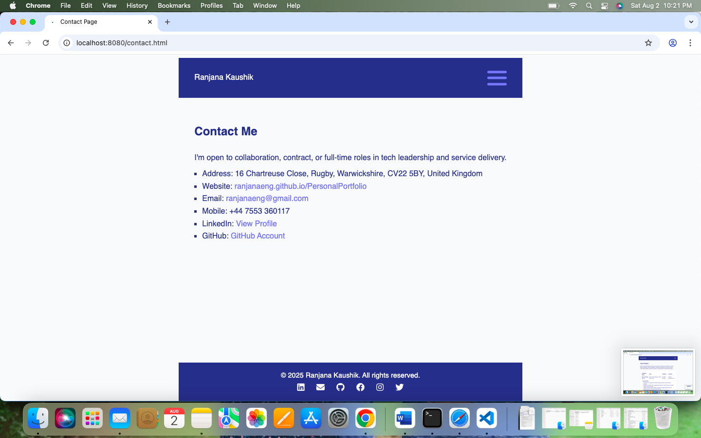

# Personal Portfolio

Welcome to my personal portfolio repository! This project showcases my skills, projects, and experience as a Technical Lead | Service Delivery Lead | Front End Developer. 

## 🚀 Features

- Overview of my professional background
- Showcases of completed projects
- Details about my skills and technologies I use
- Downloadable resume/CV
- Contact information

## 🛠️ Built With

- HTML, CSS, JavaScript, GitHub Pages
- To use social media icons- stylesheet used https://cdnjs.cloudflare.com/ajax/libs/font-awesome/6.4.2/css/all.min.css

## 📸 Screenshots

### Home Page


### About Me


### Projects


### Client Projects


### Contact Me



## 📂 Structure

```
├── .vscode
│   ├── launch.json
├── certification/
│   ├── Azure-Certificate.pdf
│   ├── CSM-Certificate.png
│   └── ITIL-Certificate.pdf
│   ├── MCTS.pdf
│   └── Microsoft-Certificate.pdf
├── docs/
│   ├── Ranjana-Kaushik-Resume.pdf   
├── images/
│   ├── profile.jpg
├── vportfolio-screenshots/
│   ├── AboutMe.png
│   ├── Client-Projects.png
│   ├── ContactMe.png
│   ├── Home-Page.png
│   ├── Projects.png
├── scripts/
│   ├── script.js
├── styles/
│   ├── style.css
├── validation-reports/
│   ├── css-validation.md
│   ├── fix-log.md
│   ├── html-validation.md
├── .gitignore
├── about.html
├── clientprojects.html
└── contact.html
├── favicon.ico
├── index.html
└── projects.html
├── README.md

```

## 📝 Usage

To run this portfolio locally:

```bash
git clone https://github.com/ranjanaeng/PersonalPortfolio.git
cd PersonalPortfolio
Start Development server in root of the project direcory npx http-server -p 8080
```

## 🚀 Deployment
GItHub Pages website : https://ranjanaeng.github.io/PersonalPortfolio/

## 📌 Credits
[Using icons on footer](https://cdnjs.cloudflare.com/ajax/libs/font-awesome/6.6.0/css/all.min.css)


## Testing Tools

| Validator           | Use For |  Link                                           |
|---------------------|---------|-------------------------------------------------|
| W3C HTML            | HTML    |   https://validator.w3.org/#validate_by_input   |
| W3C CSS             | CSS     | http://jigsaw.w3.org/css-validator/             |


## 🎨 Customization

Feel free to fork this repository and customize it for your own use! If you do, please give credit.

## 📬 Contact

You can reach me at:  
- Email: ranjanaeng@gmail.com
- LinkedIn: https://linkedin.com/in/ranjana-k-0b615b68


## 📄 License

Not Required.

---

Thank you for visiting my portfolio!
